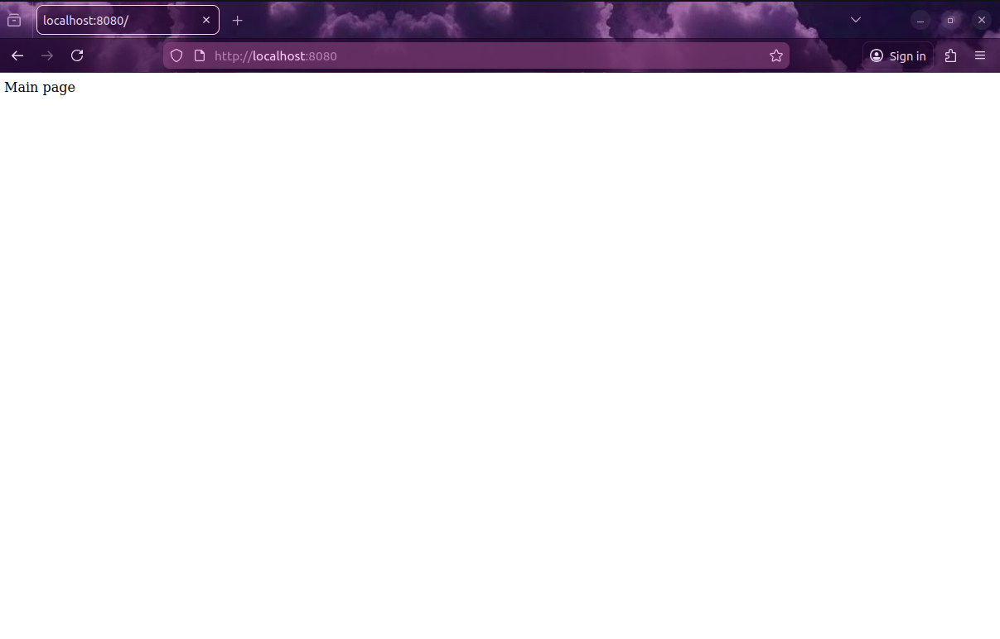

# Sd_P2
## Practica 2


En esta práctica vamos a implementar un servicio para gestionar un catálogo de películas y sus correspondientes valoraciones y comentarios realizados por los usuarios.

El sistema permitirá:

• registrar películas en el catálogo.

• consultar las películas del catálogo.

• buscar películas por género, año o si siguen en cartelera.

• añadir valoraciones y comentarios sobre una película.

• consultar las valoraciones de una película.

• calcular la valoración media de una película.

• buscar películas cuyos comentarios contengan una palabra determinada.

• obtener estadísticas generales del catálogo.


Para implementar este servicio, el sistema necesita gestionar dos tipos de recursos:

• películas

• valoraciones


Cada película tendrá información básica como el título, el género, el año de estreno y un campo que indica si la película sigue disponible en el cine.

Cada valoración estará formada por:

• rating: puntuación numérica entre 1 y 5

• comment: comentario de texto con la opinión del usuario

## Versiones del codigo - Estable v1.0

## IMPORTANTE
⚠︎ El servidor se ejecuta primero y luego el cliente para implementar las pelicula en terminales diferentes

⚠︎ Cambia el codigo del cliente para añadir / eliminar peliculas 

## Preparacion

Creamos el package.json con `npm init` y se conecta al github:

```json
{
  "name": "server",
  "version": "1.0.0",
  "description": "Server package",
  "main": "index.js",
  "private": true,
  "scripts": {
    "test": "echo \"Error: no test specified\" && exit 1",
    "start": "node server.js"
  },
  "author": "Atakito",
  "license": "ISC",
  "type": "module",
  "esversion": 6,
  "dependencies": {
    "axios": "^1.13.6",
    "body-parser": "^1.20.4",
    "express": "^4.22.1",
    "uuid": "^9.0.1"
  },
  "repository": {
    "type": "git",
    "url": "git+https://github.com/Atakito9/Sd_P2.git"
  },
  "bugs": {
    "url": "https://github.com/Atakito9/Sd_P2/issues"
  },
  "homepage": "https://github.com/Atakito9/Sd_P2#readme"
}
```
Luego con `npm install` instalamos las librerias express y axios.

## Inicio de la Practica
### Paso 1 - Metodos iniciales del server

Server.js:
```javascript
app.get('/', (req, res) => {
    res.send('Main page')
    //Importante: Ejecutar res.send siempre para poder
    //completar la petición, y no dejar la conexión pendiente,
    //incluso si no se quiere enviar nada de vuelta
})
```

Client.js:
```javascript
import axios from 'axios'

const server = 'http://localhost:8080'

async function testHelloWorld(){
    const result = await axios.get(server + '/')
    return result.data // el campo data contendrá el resultado
}

const hello = await testHelloWorld()
console.log('Prueba de conexión, resultado: ' + hello)
```
Al ejecutar el cliente, se ve en consola el resultado de la prueba de conexión.


### Paso 2 - Completar el API para implementar/eliminar peliculas

```javascript

```

Añadimos esta funcion en el client.js para cada vez que iniciamos el servidor enviar los datos por el cliente:
```javascript
async function runTests() {
    try {
        // Añadir una película
        await axios.put(`${server}/movie/m1`, {
            title: "Inception",
            genre: "sci-fi",
            year: 2010,
            in_cinema: false
        })
        
        // Añadir valoración
        let reviewData = { rating: 5, comment: "Excelente película" }
        await axios.put(`${server}/review/m1`, reviewData)

        // Añadir una película
        await axios.put(`${server}/movie/m2`, {
            title: "Star Wars Ep:1",
            genre: "sci-fi",
            year: 2001,
            in_cinema: false
        })
        
        // Añadir valoración
        reviewData = { rating: 5, comment: "Excelente película, muy mítica" }
        await axios.put(`${server}/review/m2`, reviewData)
        
        // Comprobar estadísticas
        const stats = await axios.get(`${server}/stats`)
        console.log("Estadísticas del sistema:", stats.data)

        // Buscar texto
        const search = await axios.get(`${server}/search?text=excelente`)
        console.log("Resultados de búsqueda:", search.data)

    } catch (error) {
        console.error("Error en las pruebas:", error.response ? error.response.data : error.message)
    }
}
```

### Paso 3 - Incluir persistencia en el sistema

Añadimos en el Server.js estas dos funciones:
```javascript
// Función para guardar los datos actuales en el archivo JSON
async function save() {
    // Creamos el objeto con el estado actual de las variables globales 
    const datosAGuardar = {
        movies: movies,
        reviews: reviews
    }
    const str = JSON.stringify(datosAGuardar)
    await writeFile('datos.json', str, 'utf8')
}

// Función para cargar los datos al iniciar
async function load() {
    try {
        const str = await readFile('datos.json', 'utf8')
        const datosCargados = JSON.parse(str)
        
        // Asignamos los datos a las variables globales
        movies = datosCargados.movies || []
        reviews = datosCargados.reviews || []
        console.log("Datos recuperados del archivo.")
    } catch (error) {
        // Si el archivo no existe, empezamos con arrays vacíos 
        console.log("Archivo no encontrado o vacío. Iniciando catálogo nuevo.")
        movies = []
        reviews = []
    }
}
```
En la funcion load va a crear un archivo datos.json en el que va a guardar todos los datos que mandemos al servidor, y cada vez que tenemos que iniciarlo no hay que mandar cada vez con el cliente los datos, creando permanencia.

## Problemas encotrados
**//TERMINAR//**
