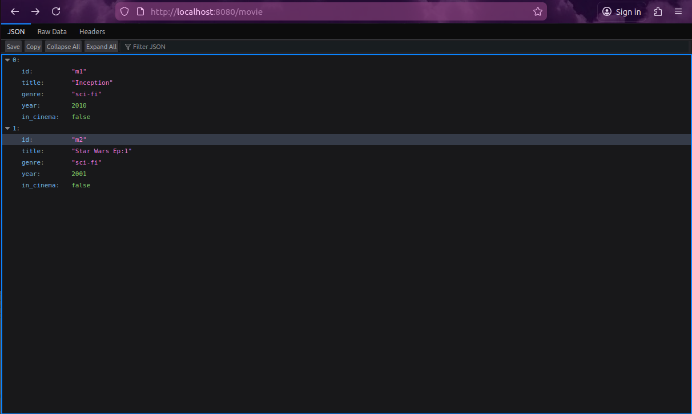
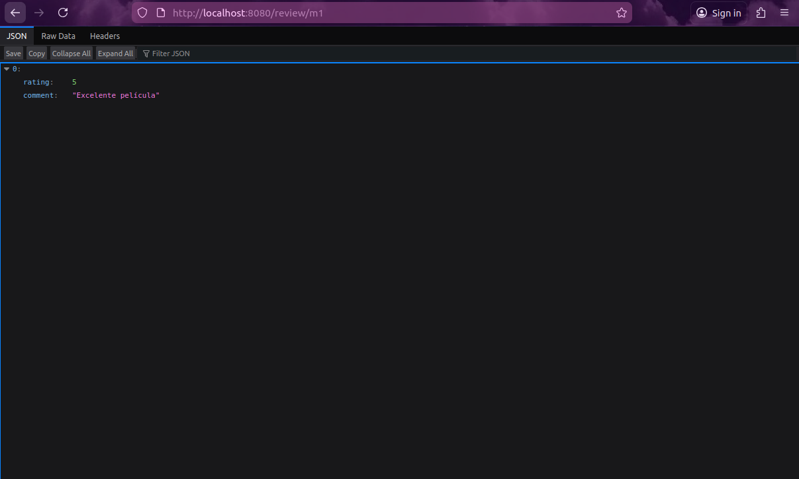

# Sd_P2
## Practica 2

<div align="center">
  
  
  
  
  <br><br>
  
</div>

<details>
<summary><b>Tabla de Contenidos (Desplegar)</b></summary>

1. [Preparacion](#preparacion)
2. [Inicio de la Practica](#inicio-de-la-practica)
    * [Paso 1 - Metodos iniciales del server](#paso-1---metodos-iniciales-del-server)
    * [Paso 2 - Completar el API para implementar/eliminar peliculas](#paso-2---completar-el-api-para-implementareliminar-peliculas)
    * [Paso 3 - Incluir persistencia en el sistema](#paso-3---incluir-persistencia-en-el-sistema)
3. [Problemas encotrados](#problemas-encotrados)

</details>

---

En esta práctica vamos a implementar un servicio para gestionar un catálogo de películas y sus correspondientes valoraciones y comentarios realizados por los usuarios.

El sistema permitirá:

- [x] registrar películas en el catálogo.
- [x] consultar las películas del catálogo.
- [x] buscar películas por género, año o si siguen en cartelera.
- [x] añadir valoraciones y comentarios sobre una película.
- [x] consultar las valoraciones de una película.
- [x] calcular la valoración media de una película.
- [x] buscar películas cuyos comentarios contengan una palabra determinada.
- [x] obtener estadísticas generales del catálogo.

Para implementar este servicio, el sistema necesita gestionar dos tipos de recursos:

• películas

• valoraciones


Cada película tendrá información básica como el título, el género, el año de estreno y un campo que indica si la película sigue disponible en el cine.

Cada valoración estará formada por:

• rating: puntuación numérica entre 1 y 5

• comment: comentario de texto con la opinión del usuario

## Versiones del codigo - Estable v1.0
```text
Sd_P2/
├── node_modules/
├── package.json
├── package-lock.json
├── server.js
├── client.js
├── datos.json
└── README.md
```

## IMPORTANTE
> [!IMPORTANT] ⚠︎ El servidor se ejecuta primero y luego el cliente para implementar las pelicula en terminales diferentes

> [!IMPORTANT] ⚠︎ Cambia el codigo del cliente para añadir / eliminar peliculas 

## Preparacion

Creamos el package.json con `npm init` y se conecta al github:

```json
{
  "name": "server",
  "version": "1.0.0",
  "description": "Server package",
  "main": "index.js",
  "private": true,
  "scripts": {
    "test": "echo \"Error: no test specified\" && exit 1",
    "start": "node server.js"
  },
  "author": "Atakito",
  "license": "ISC",
  "type": "module",
  "esversion": 6,
  "dependencies": {
    "axios": "^1.13.6",
    "body-parser": "^1.20.4",
    "express": "^4.22.1",
    "uuid": "^9.0.1"
  },
  "repository": {
    "type": "git",
    "url": "git+https://github.com/Atakito9/Sd_P2.git"
  },
  "bugs": {
    "url": "https://github.com/Atakito9/Sd_P2/issues"
  },
  "homepage": "https://github.com/Atakito9/Sd_P2#readme"
}
```
Luego con `npm install` instalamos las librerias express y axios.

## Inicio de la Practica
### Paso 1 - Metodos iniciales del server
Usamos el codigo dado y creamos 2 archivos nuevos, uno sera Server.js y el otro Client.js.

Server.js:
```javascript
app.get('/', (req, res) => {
    res.send('Main page')
    //Importante: Ejecutar res.send siempre para poder
    //completar la petición, y no dejar la conexión pendiente,
    //incluso si no se quiere enviar nada de vuelta
})
```

Client.js:
```javascript
import axios from 'axios'

const server = 'http://localhost:8080'

async function testHelloWorld(){
    const result = await axios.get(server + '/')
    return result.data // el campo data contendrá el resultado
}

const hello = await testHelloWorld()
console.log('Prueba de conexión, resultado: ' + hello)
```

Al ejecutar el servidor, se ve en consola el resultado de la prueba de conexión.


### Paso 2 - Completar el API para implementar/eliminar peliculas

Añadimos estas rutas en server.js para gestionar la creación y borrado de los recursos:
```javascript
// Añadir o actualizar una película
app.put('/movie/:id', async (req, res) => {
    const movieId = req.params.id
    const movieData = req.body
    
    const index = movies.findIndex(m => m.id === movieId)
    
    if (index >= VALOR_NULO) {
        // Si existe, se actualiza
        movies[index] = { id: movieId, ...movieData }
    } else {
        // Si no existe, se crea
        movies.push({ id: movieId, ...movieData })
    }
    
    await save()
    res.send({ status: 'success', id: movieId })
})

// Eliminar una película
app.delete('/movie/:id', async (req, res) => {
    const movieId = req.params.id
    const index = movies.findIndex(m => m.id === movieId)
    
    if (index < VALOR_NULO) {
        // Si no existe se devuelve un error
        return res.status(404).send({ error: 'Movie not found' })
    }
    
    movies.splice(index, 1)
    // Se eliminan también las valoraciones asociadas
    reviews = reviews.filter(r => r.movieId !== movieId)
    
    await save()
    res.send({ status: 'deleted' })
})
```

Ahora que podemos añadir y eliminar peliculas, necesitamos un metodo para filtrar y buscar las peliculas.
Con este codigo conseguimos esto y si la pelicula no existe, el servidor lanza un 404 al usuario:
```javascript
app.get('/movie/:id', (req, res) => {
    const movieId = req.params.id
    const index = movies.findIndex(m => m.id === movieId)
    
    if (index >= VALOR_NULO) {
        res.send(movies[index])
    } else {
        res.status(404).send({ error: 'Movie not found' })
    }
})
```

En resumen, esto es lo que hace la primera parte de nuestro codigo:
* **Consultas (`GET /movie` y `GET /movie/:id`):** Permite listar el catálogo completo o buscar una entidad concreta. Soporta la aplicación de filtros mediante *query parameters* (por ejemplo, buscar por género o año).
* **Registros y Actualizaciones (`PUT /movie/:id`):** Evalúa la existencia previa del identificador proporcionado. Si la comprobación devuelve un índice igual o superior a un límite nulo, actualiza las propiedades; si no, instancia una nueva película.
* **Borrado (`DELETE /movie/:id`):** Retira la película del sistema y, para garantizar la integridad, purga cualquier valoración que referencie dicho identificador.

Ademas de filtrar por peliculas tambien queremos ver y añadir comentarios, estadisticas de la pelicula, valoracion media, y filtrar por comentarios.
```javascript
// Añadir una valoración
app.put('/review/:movieId', async (req, res) => {
    const movieId = req.params.movieId
    const { rating, comment } = req.body
    
    // Comprobar que la película existe
    const movieExists = movies.some(m => m.id === movieId)
    if (!movieExists) {
        return res.status(404).send({ error: 'Movie not found' })
    }
    
    // Rating debe estar entre los límites establecidos
    if (!Number.isInteger(rating) || rating < MIN_RATING || rating > MAX_RATING) {
        return res.status(400).send({ error: `Rating must be an integer between ${MIN_RATING} and ${MAX_RATING}` })
    }
    
    reviews.push({ movieId, rating, comment })
    await save()
    res.send({ status: 'success' })
})

// Eliminar valoraciones de una película
app.delete('/review/:movieId', async (req, res) => {
    const movieId = req.params.movieId
    
    // Comprobar que la película existe
    const movieExists = movies.some(m => m.id === movieId)
    if (!movieExists) {
        return res.status(404).send({ error: 'Movie not found' }) 
    }
    
    // Eliminar todas las valoraciones asociadas
    reviews = reviews.filter(r => r.movieId !== movieId)
    await save()
    res.send({ status: 'reviews deleted' })
})

//Devolver al cliente
app.get('/review/:movieId', (req, res) => {
    const movieId = req.params.movieId
    const movieReviews = reviews.filter(r => r.movieId === movieId).map(({ rating, comment }) => ({ rating, comment }))
    
    res.send(movieReviews)
})

// --- CONSULTAS Y ESTADÍSTICAS ---

// Obtener valoración media de una película
app.get('/rating/:movieId', (req, res) => {
    const movieId = req.params.movieId
    const movieReviews = reviews.filter(r => r.movieId === movieId)
    const nReviews = movieReviews.length
    
    // Cálculo simbólico de la media
    let average = VALOR_NULO // Si no existen valoraciones la media será 0
    if (nReviews > VALOR_NULO) {
        const sum = movieReviews.reduce((acc, curr) => acc + curr.rating, VALOR_NULO)
        average = sum / nReviews
    }
    
    res.send({ movie: movieId, reviews: nReviews, average })
})

// Obtener estadísticas globales
app.get('/stats', (req, res) => {
    const totalMovies = movies.length
    const totalReviews = reviews.length
    
    let averageRating = VALOR_NULO // Si no existen valoraciones la media será 0
    if (totalReviews > VALOR_NULO) {
        const sum = reviews.reduce((acc, curr) => acc + curr.rating, VALOR_NULO)
        averageRating = sum / totalReviews // Media de todas las valoraciones
    }
    
    res.send({ movies: totalMovies, reviews: totalReviews, average_rating: averageRating })
})
// Búsqueda en comentarios
app.get('/search', (req, res) => {
    const searchText = req.query.text ? req.query.text.toLowerCase() : ''
    
    const results = movies.map(movie => {
        const movieReviews = reviews.filter(r => r.movieId === movie.id)
        // La búsqueda no distingue entre mayúsculas y minúsculas
        const matches = movieReviews.filter(r => r.comment && r.comment.toLowerCase().includes(searchText)).length
        
        return { id: movie.id, title: movie.title, matches }
    }).filter(movie => movie.matches > VALOR_NULO) // Solo se devolverán películas con coincidencias
    
    res.send(results)
})
```
Resumiendo, esto es lo que hace la segunda parte de este codigo:

* **Aportaciones de usuarios (`PUT /review/:movieId`):** Verifica que la película de destino exista en el sistema y aplica una validación estricta para garantizar que la puntuación se mantenga dentro de los límites esperados (valor mínimo y valor máximo permitidos).
* **Lectura (`GET /review/:movieId`):** Filtra y retorna las valoraciones asociadas al identificador de la película solicitada.
* **Limpieza (`DELETE /review/:movieId`):** Permite el borrado independiente de todas las interacciones de los usuarios sobre una película concreta.
* **Cálculo de medias (`GET /rating/:movieId`):** Evalúa todas las reseñas de una película. Si la cantidad de reseñas es superior a un valor nulo, realiza el sumatorio y obtiene la media; de lo contrario, devuelve una magnitud base de ausencia o estado vacío.
* **Estadísticas globales (`GET /stats`):** Cuantifica el volumen de datos en memoria (total de entidades y valoraciones) junto con el promedio general del servicio.
* **Motor de texto (`GET /search`):** Analiza recursivamente el contenido de los comentarios en busca de coincidencias con la cadena solicitada, retornando un mapeo de las películas que lo contienen.

Por ultimo añadimos esta funcion en el client.js para cada vez que iniciamos el servidor enviar los datos por el cliente:
```javascript
async function runTests() {
    try {
        // Añadir una película
        await axios.put(`${server}/movie/m1`, {
            title: "Inception",
            genre: "sci-fi",
            year: 2010,
            in_cinema: false
        })
        
        // Añadir valoración
        let reviewData = { rating: 5, comment: "Excelente película" }
        await axios.put(`${server}/review/m1`, reviewData)

        // Añadir una película
        await axios.put(`${server}/movie/m2`, {
            title: "Star Wars Ep:1",
            genre: "sci-fi",
            year: 2001,
            in_cinema: false
        })
        
        // Añadir valoración
        reviewData = { rating: 5, comment: "Excelente película, muy mítica" }
        await axios.put(`${server}/review/m2`, reviewData)
        
        // Comprobar estadísticas
        const stats = await axios.get(`${server}/stats`)
        console.log("Estadísticas del sistema:", stats.data)

        // Buscar texto
        const search = await axios.get(`${server}/search?text=excelente`)
        console.log("Resultados de búsqueda:", search.data)

    } catch (error) {
        console.error("Error en las pruebas:", error.response ? error.response.data : error.message)
    }
}
```
Despues de haber ejecutado el servidor(`node server.js`) y el cliente (`node client.js`) aqui podemos ver si buscamos las peliculas, nos va a salir en formato codigo lo que hemos enviado por el cliente (Nuestra base de datos por ahora)



### Paso 3 - Incluir persistencia en el sistema

Añadimos en el Server.js estas dos funciones:
```javascript
// Función para guardar los datos actuales en el archivo JSON
async function save() {
    // Creamos el objeto con el estado actual de las variables globales 
    const datosAGuardar = {
        movies: movies,
        reviews: reviews
    }
    const str = JSON.stringify(datosAGuardar)
    await writeFile('datos.json', str, 'utf8')
}

// Función para cargar los datos al iniciar
async function load() {
    try {
        const str = await readFile('datos.json', 'utf8')
        const datosCargados = JSON.parse(str)
        
        // Asignamos los datos a las variables globales
        movies = datosCargados.movies || []
        reviews = datosCargados.reviews || []
        console.log("Datos recuperados del archivo.")
    } catch (error) {
        // Si el archivo no existe, empezamos con arrays vacíos 
        console.log("Archivo no encontrado o vacío. Iniciando catálogo nuevo.")
        movies = []
        reviews = []
    }
}
```
En la funcion load va a crear un archivo datos.json en el que va a guardar todos los datos que mandemos al servidor, y cada vez que tenemos que iniciarlo no hay que mandar cada vez con el cliente los datos, creando permanencia.
Cada vez que se añada algo desde el cliente, la funcion save va a escribir en el archivo para la proxima vez.

## Problemas encotrados
**//TERMINAR//**

## Creditos
<div align="center">


</div>

<div align="center">


</div>
